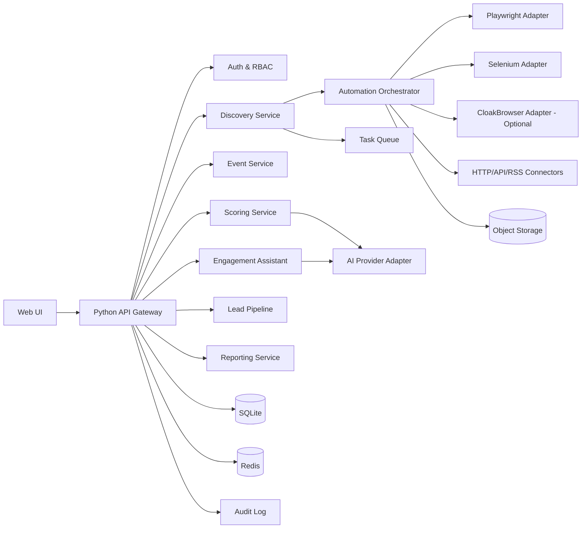
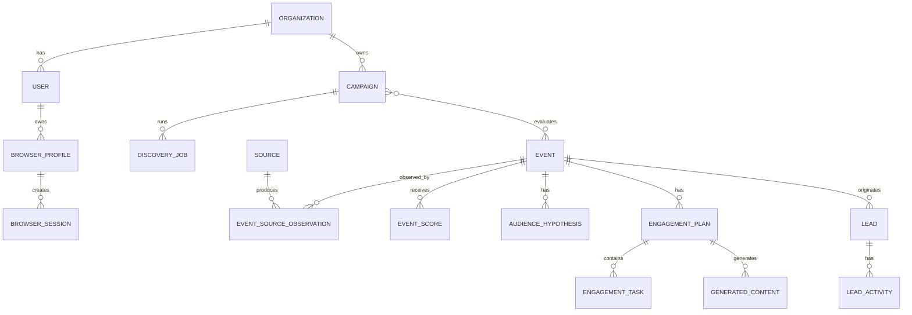

# SOFTWARE REQUIREMENTS SPECIFICATION (SRS)

## LiveLead Discovery & Engagement Tool

**Tên tiếng Việt:** Công cụ tìm kiếm và tương tác Livestream khách hàng tiềm năng  
**Mã tài liệu:** LLDE-SRS-001  
**Phiên bản:** 1.0.0  
**Trạng thái:** Baseline đề xuất cho MVP  
**Ngày phát hành:** 2026-06-13  
**Ngôn ngữ tài liệu:** Tiếng Việt  
**Chuẩn tham chiếu:** ISO/IEC/IEEE 29148:2018  

---

## Lịch sử phiên bản

| Phiên bản | Ngày | Mô tả | Trạng thái |
|---|---:|---|---|
| 0.1 | 2026-06-13 | Chuyển đổi ý tưởng ban đầu thành cấu trúc SRS | Bản nháp |
| 1.0 | 2026-06-13 | Hoàn thiện yêu cầu MVP, kiến trúc Python, giao diện tương tác và browser automation | Baseline đề xuất |

---

# 1. Giới thiệu

## 1.1. Mục đích tài liệu

Tài liệu này xác định đầy đủ yêu cầu nghiệp vụ, yêu cầu chức năng, yêu cầu phi chức năng, giao diện, dữ liệu, kiến trúc, giới hạn vận hành, tiêu chí nghiệm thu và kế hoạch xác minh cho hệ thống **LiveLead Discovery & Engagement Tool**.

Tài liệu được tổ chức theo tinh thần của ISO/IEC/IEEE 29148:2018: mỗi yêu cầu quan trọng có mã định danh, nội dung có thể kiểm chứng, mức ưu tiên và tiêu chí chấp nhận rõ ràng.

SRS này là cơ sở để:

- Chủ sản phẩm thống nhất phạm vi với đội phát triển.
- Kiến trúc sư thiết kế hệ thống.
- Lập trình viên triển khai backend Python, giao diện web và các adapter tự động hóa trình duyệt.
- QA xây dựng test plan, test case và bộ kiểm thử chấp nhận.
- DevOps triển khai, giám sát và vận hành hệ thống.
- Bộ phận pháp lý hoặc compliance đánh giá rủi ro sử dụng dữ liệu và nền tảng bên thứ ba.

## 1.2. Phạm vi sản phẩm

LiveLead là một ứng dụng web có giao diện tương tác, hỗ trợ người dùng tìm kiếm các livestream, webinar, hội nghị trực tuyến và sự kiện hybrid có khả năng chứa khách hàng tiềm năng.

Hệ thống thực hiện bảy nhiệm vụ cốt lõi:

1. Nhận hồ sơ tìm kiếm thị trường và chân dung khách hàng mục tiêu.
2. Khám phá sự kiện từ nguồn được phép truy cập.
3. Chuẩn hóa, khử trùng lặp và phân loại trạng thái sự kiện.
4. Phân tích nhóm người tham dự và chấm điểm mức độ ưu tiên.
5. Tạo kế hoạch tương tác trước, trong và sau sự kiện.
6. Gợi ý bình luận, câu hỏi, tin nhắn và nội dung follow-up để người dùng duyệt.
7. Lưu lead, hoạt động, trạng thái và kết quả vào pipeline nội bộ.

Hệ thống **không phải bot bán hàng tự động**. Trong MVP, mọi hành động có khả năng tạo nội dung công khai hoặc gửi thông điệp tới người khác phải được người dùng xem xét và chủ động xác nhận bên ngoài hệ thống hoặc trong một bước xác nhận riêng.

## 1.3. Mục tiêu kinh doanh

| Mã | Mục tiêu |
|---|---|
| BG-01 | Giảm thời gian tìm kiếm thủ công các livestream và webinar phù hợp. |
| BG-02 | Tăng tỷ lệ tập trung vào sự kiện có khách hàng mục tiêu chất lượng. |
| BG-03 | Chuẩn hóa quy trình chuẩn bị tương tác trước, trong và sau sự kiện. |
| BG-04 | Tăng số kết nối chuyên môn, cuộc trò chuyện, cuộc hẹn và cơ hội hợp tác có thể đo lường. |
| BG-05 | Tạo một quy trình tìm kiếm lead qua sự kiện có thể lặp lại, kiểm soát và mở rộng. |
| BG-06 | Duy trì nguyên tắc không spam, tôn trọng quyền riêng tư và điều khoản nền tảng. |

## 1.4. Đối tượng đọc

- Product Owner.
- Business Analyst.
- Software Architect.
- Python Backend Developer.
- Frontend Developer.
- Browser Automation Engineer.
- AI/ML Engineer.
- QA/QC Engineer.
- DevOps/SRE.
- Security và Compliance Officer.
- Người vận hành hệ thống.

## 1.5. Định nghĩa và thuật ngữ

| Thuật ngữ | Định nghĩa |
|---|---|
| Livestream | Nội dung video hoặc âm thanh được phát trực tiếp trên nền tảng trực tuyến. |
| Webinar | Hội thảo trực tuyến có đăng ký hoặc truy cập công khai. |
| Hybrid event | Sự kiện kết hợp trực tiếp và trực tuyến. |
| Lead | Cá nhân hoặc tổ chức có khả năng trở thành khách hàng, đối tác hoặc nguồn giới thiệu. |
| ICP | Ideal Customer Profile, hồ sơ khách hàng lý tưởng. |
| Engagement plan | Kế hoạch tương tác trước, trong và sau sự kiện. |
| Browser automation | Điều khiển trình duyệt bằng mã để điều hướng, đọc dữ liệu hoặc hỗ trợ thao tác. |
| Connector | Thành phần tích hợp với một nguồn dữ liệu hoặc nền tảng cụ thể. |
| Adapter | Lớp trừu tượng cho phép thay đổi engine hoặc nhà cung cấp mà không ảnh hưởng nghiệp vụ. |
| Human-in-the-loop | Cơ chế yêu cầu con người xem xét hoặc xác nhận trước hành động nhạy cảm. |
| Public data | Dữ liệu hiển thị công khai, không yêu cầu vượt kiểm soát truy cập. |
| Source policy | Cấu hình quy định nguồn nào được phép truy cập, tần suất và loại dữ liệu được thu thập. |
| CloakBrowser | Chromium tùy biến có wrapper tương thích Playwright, chỉ được coi là adapter tùy chọn trong hệ thống. |
| PII | Personally Identifiable Information, dữ liệu nhận dạng cá nhân. |
| RBAC | Role-Based Access Control, kiểm soát truy cập theo vai trò. |
| LLM | Large Language Model, mô hình ngôn ngữ lớn. |

## 1.6. Tài liệu tham chiếu

- ISO/IEC/IEEE 29148:2018 — Requirements Engineering.
- Playwright for Python — tài liệu chính thức về browser automation, browser context, page và network.
- Selenium WebDriver — tài liệu chính thức về W3C WebDriver và Python bindings.
- CloakHQ/CloakBrowser — repository chính thức của dự án.
- OWASP ASVS — hướng dẫn yêu cầu bảo mật ứng dụng web.
- OWASP Top 10 — nhóm rủi ro phổ biến của ứng dụng web.
- RFC 9110 — HTTP Semantics.
- WCAG 2.2 — hướng dẫn khả năng tiếp cận giao diện web.

---

# 2. Mô tả tổng quan

## 2.1. Bối cảnh sản phẩm

Thông tin sự kiện hiện phân tán trên nhiều kênh: công cụ tìm kiếm, website sự kiện, YouTube, LinkedIn, Facebook, X, Reddit, website hiệp hội, nền tảng webinar, lịch cộng đồng và trang của đơn vị tổ chức.

LiveLead cung cấp một lớp hợp nhất gồm:

- Khám phá dữ liệu.
- Chuẩn hóa sự kiện.
- Phân tích và xếp hạng.
- Trợ lý tạo nội dung.
- Quản lý lead.
- Theo dõi hiệu quả.

## 2.2. Nguyên tắc sản phẩm

1. **Value-first:** mọi gợi ý tương tác ưu tiên đóng góp giá trị.
2. **Human-controlled:** người dùng quyết định nội dung và hành động gửi.
3. **Compliant-by-design:** không thiết kế chức năng vượt CAPTCHA, phá kiểm soát truy cập hoặc spam.
4. **Explainable scoring:** điểm ưu tiên phải có lý do và thành phần điểm.
5. **Source-aware:** mỗi dữ liệu phải có nguồn, thời gian thu thập và mức tin cậy.
6. **Replaceable automation:** Playwright, Selenium và engine Chromium tùy chọn được đặt sau một interface chung.
7. **Privacy minimization:** chỉ lưu dữ liệu cần thiết cho mục đích nghiệp vụ hợp pháp.
8. **Auditability:** thao tác thu thập, thay đổi lead, gọi AI và phê duyệt nội dung phải có log.

## 2.3. Nhóm người dùng

| Vai trò | Mô tả | Quyền chính |
|---|---|---|
| System Owner | Chủ hệ thống hoặc tenant | Quản lý tổ chức, chính sách, cấu hình tổng thể |
| Administrator | Quản trị viên | Quản lý người dùng, connector, quota, audit |
| Analyst | Nhân viên nghiên cứu/marketing | Tạo truy vấn, phân tích sự kiện, tạo báo cáo |
| Sales/BD User | Nhân viên sales hoặc business development | Lưu lead, dùng engagement plan, cập nhật pipeline |
| Reviewer | Người duyệt nội dung | Duyệt hoặc từ chối nội dung AI đề xuất |
| Viewer | Người chỉ xem | Xem dashboard, sự kiện, báo cáo được cấp quyền |
| Service Account | Tài khoản máy | Chạy job nền theo phạm vi giới hạn |

## 2.4. Môi trường vận hành

### 2.4.1. Máy chủ

- Linux x86_64 là môi trường triển khai chính.
- Python 3.12 hoặc phiên bản LTS được dự án phê duyệt.
- SQLite là database chính cho baseline hiện tại, lưu dưới dạng file trong thư mục dự án.
- Redis cho cache, rate limit và queue broker.
- Object storage tương thích S3 cho ảnh chụp, file export và artifact.
- Docker hoặc OCI container.

### 2.4.2. Trình duyệt tự động

- Playwright Chromium là engine mặc định.
- Selenium WebDriver là engine dự phòng hoặc dùng cho connector yêu cầu WebDriver.
- CloakBrowser là engine Chromium tùy chọn thông qua adapter riêng.
- Chế độ headed được ưu tiên cho tác vụ cần người dùng đăng nhập hoặc giám sát.
- Chế độ headless chỉ dùng cho nguồn cho phép tự động hóa và không yêu cầu tương tác người dùng.

### 2.4.3. Giao diện người dùng

- Trình duyệt desktop: Chrome, Edge, Firefox và Safari phiên bản còn được hỗ trợ.
- Responsive cho tablet; mobile hỗ trợ các tác vụ xem và cập nhật đơn giản.
- Giao diện tiếng Việt và tiếng Anh trong MVP hoặc ngay sau MVP.

## 2.5. Ràng buộc

| Mã | Ràng buộc |
|---|---|
| CON-01 | Backend nghiệp vụ phải được triển khai bằng Python. |
| CON-02 | Hệ thống phải có giao diện web tương tác; không chỉ là CLI. |
| CON-03 | Browser automation phải nằm sau interface adapter để thay đổi Playwright/Selenium/CloakBrowser. |
| CON-04 | MVP không tự động đăng bình luận hoặc gửi tin nhắn hàng loạt. |
| CON-05 | Hệ thống không được tự động vượt CAPTCHA, MFA hoặc kiểm soát truy cập. |
| CON-06 | Chỉ thu thập dữ liệu từ nguồn được cấu hình cho phép và trong giới hạn chính sách nguồn. |
| CON-07 | Mọi dữ liệu sự kiện phải lưu URL nguồn và thời điểm quan sát. |
| CON-08 | Mọi nội dung do AI tạo phải được gắn nhãn và có bước người dùng duyệt trước khi sử dụng. |
| CON-09 | Không cam kết doanh thu; hệ thống chỉ hỗ trợ khám phá, phân tích và quản lý cơ hội. |
| CON-10 | Thông tin xác thực nền tảng không được lưu dạng văn bản thuần. |

## 2.6. Giả định và phụ thuộc

- Người dùng có mục đích kinh doanh hợp pháp và có quyền xử lý dữ liệu trong phạm vi sử dụng.
- Một số nền tảng thay đổi DOM, API hoặc điều khoản; connector có thể cần bảo trì thường xuyên.
- Dữ liệu số người tham dự hoặc danh sách người tham dự có thể không công khai.
- Dịch vụ AI có thể là cloud API hoặc mô hình nội bộ.
- Chất lượng xếp hạng phụ thuộc độ đầy đủ của ICP và dữ liệu sự kiện.
- Đăng nhập vào nền tảng bên thứ ba có thể yêu cầu người dùng thao tác thủ công.

## 2.7. Ngoài phạm vi MVP

- Tự động gửi lời mời kết nối hoặc tin nhắn hàng loạt.
- Tự động đăng bình luận trong livestream.
- Vượt CAPTCHA, MFA, bot challenge hoặc paywall.
- Mua proxy tự động hoặc xoay proxy để né giới hạn nền tảng.
- Thu thập dữ liệu tài khoản riêng tư.
- Nhận dạng khuôn mặt hoặc suy luận thuộc tính nhạy cảm.
- Tự động quyết định loại bỏ hoặc ưu tiên con người dựa trên thuộc tính nhạy cảm.
- Thay thế CRM doanh nghiệp đầy đủ.
- Cam kết chuyển đổi lead hoặc doanh thu.

---

# 3. Kiến trúc hệ thống đề xuất

## 3.1. Kiến trúc logic



## 3.2. Kiến trúc triển khai MVP

Khuyến nghị sử dụng **modular monolith** cho MVP để giảm độ phức tạp vận hành, nhưng thiết kế module và event nội bộ phải cho phép tách service sau này.

Các process chính:

1. `web-api`: FastAPI REST API và WebSocket/SSE.
2. `worker`: Celery, Dramatiq hoặc ARQ worker cho discovery và AI jobs.
3. `scheduler`: lập lịch tìm kiếm và đồng bộ.
4. `browser-worker`: worker cô lập chạy Playwright/Selenium/CloakBrowser.
5. `frontend`: React/Next.js hoặc giao diện tương đương.
6. `sqlite-db`: file dữ liệu nghiệp vụ trong thư mục dự án.
7. `redis`: broker, cache và distributed lock.
8. `object-storage`: screenshot, HTML snapshot, export.

## 3.3. Công nghệ đề xuất

| Lớp | Công nghệ ưu tiên | Ghi chú |
|---|---|---|
| Backend | Python 3.12+, FastAPI, Pydantic | API async, schema rõ ràng |
| ORM | SQLAlchemy 2.x | Hỗ trợ async và migration |
| Migration | Alembic | Quản lý schema |
| Database | SQLite | File trong dự án, đơn giản cho MVP và local-first |
| Queue | Celery/Dramatiq/ARQ + Redis | Job nền, retry |
| Browser | Playwright Python | Engine mặc định |
| Browser fallback | Selenium Python | Connector đặc thù |
| Optional Chromium | CloakBrowser adapter | Chỉ dùng theo policy |
| Frontend | React + TypeScript + Next.js/Vite | UI tương tác |
| UI components | Material UI, Ant Design hoặc shadcn/ui | Chọn một hệ thống thống nhất |
| AI | Provider abstraction | OpenAI-compatible hoặc local model |
| Testing | Pytest, Playwright test/E2E, Hypothesis | Unit, integration, E2E |
| Observability | OpenTelemetry, Prometheus, Grafana, Sentry | Metrics, traces, errors |
| Packaging | Docker Compose cho dev; Kubernetes tùy quy mô | Không bắt buộc K8s cho MVP |

## 3.4. Browser Automation Abstraction

```python
from typing import Protocol

class BrowserAutomationAdapter(Protocol):
    async def start_session(self, profile_id: str | None = None) -> str: ...
    async def navigate(self, session_id: str, url: str) -> None: ...
    async def extract(self, session_id: str, recipe: dict) -> dict: ...
    async def screenshot(self, session_id: str) -> str: ...
    async def export_storage_state(self, session_id: str) -> dict: ...
    async def close_session(self, session_id: str) -> None: ...
```

Các implementation:

- `PlaywrightAdapter` — mặc định, hỗ trợ browser context cô lập, auto-wait và network events.
- `SeleniumAdapter` — tương thích W3C WebDriver và Grid.
- `CloakBrowserAdapter` — wrapper tùy chọn sử dụng API tương thích Playwright hoặc CDP theo tài liệu dự án.

Business logic không được import trực tiếp Playwright, Selenium hoặc CloakBrowser.

## 3.5. Quy tắc lựa chọn engine

| Trường hợp | Engine |
|---|---|
| Website công khai, DOM hiện đại, cần async | Playwright |
| Connector đã có code WebDriver hoặc chạy Selenium Grid | Selenium |
| Website cần Chromium tùy biến và việc sử dụng được pháp lý/compliance phê duyệt | CloakBrowser adapter |
| Có API/RSS/ICS chính thức | Không dùng browser; ưu tiên HTTP/API connector |
| Trang yêu cầu CAPTCHA/MFA | Chuyển sang interactive headed session cho người dùng; không tự vượt |

---

# 4. Quy trình nghiệp vụ chính

## 4.1. Tạo chiến dịch tìm kiếm

1. Người dùng tạo workspace hoặc campaign.
2. Người dùng nhập lĩnh vực, sản phẩm, khu vực, ngôn ngữ, thời gian và ICP.
3. Hệ thống kiểm tra dữ liệu và gợi ý từ khóa mở rộng.
4. Người dùng chọn nguồn được phép tìm kiếm.
5. Hệ thống tạo discovery job.
6. Worker tìm kiếm, chuẩn hóa, khử trùng lặp và lưu kết quả.
7. Hệ thống chấm điểm sự kiện và hiển thị giải thích.

## 4.2. Đánh giá một livestream

1. Người dùng mở chi tiết sự kiện.
2. Hệ thống hiển thị thông tin nguồn, trạng thái, diễn giả, tổ chức và nhóm người tham dự dự kiến.
3. Hệ thống hiển thị tổng điểm và từng thành phần điểm.
4. Người dùng đánh dấu ưu tiên, theo dõi hoặc loại trừ.
5. Hệ thống cập nhật phản hồi để cải thiện xếp hạng sau này.

## 4.3. Tạo kế hoạch tương tác

1. Người dùng chọn sự kiện.
2. Hệ thống xác định giai đoạn trước/đang/sau sự kiện.
3. Hệ thống tạo checklist và nội dung gợi ý.
4. Người dùng chọn giọng văn, ngôn ngữ, persona và CTA.
5. AI tạo phương án có nguồn ngữ cảnh.
6. Người dùng sửa, duyệt, sao chép hoặc đánh dấu đã sử dụng.
7. Hệ thống lưu phiên bản và kết quả.

## 4.4. Tạo và quản lý lead

1. Người dùng tạo lead từ diễn giả, tổ chức hoặc người tham gia được phép ghi nhận.
2. Hệ thống kiểm tra trùng lặp.
3. Người dùng bổ sung công ty, vai trò, nhu cầu, nguồn và ghi chú.
4. Người dùng cập nhật trạng thái pipeline.
5. Hệ thống nhắc follow-up và ghi nhận outcome.

## 4.5. Interactive Browser Session

1. Người dùng chọn “Mở trong trình duyệt hỗ trợ”.
2. Hệ thống khởi tạo profile hoặc context cô lập.
3. Browser mở ở chế độ headed và hiển thị trạng thái cho người dùng.
4. Người dùng tự đăng nhập nếu cần.
5. Hệ thống chỉ thực hiện action đã được policy cho phép.
6. Trước thao tác gửi nội dung, hệ thống dừng tại bước preview/confirmation.
7. Người dùng chủ động xác nhận hoặc thực hiện thủ công.
8. Hệ thống lưu audit event, không lưu mật khẩu.

---

# 5. Yêu cầu chức năng

Quy ước ưu tiên:

- **Must:** bắt buộc cho MVP.
- **Should:** nên có trong MVP hoặc bản ngay sau MVP.
- **Could:** tùy chọn.
- **Won't (MVP):** không triển khai trong MVP.

## 5.1. Quản lý tổ chức, người dùng và quyền

### FR-AUTH-001 — Đăng nhập

- **Ưu tiên:** Must
- Hệ thống phải cho phép người dùng đăng nhập bằng email và mật khẩu hoặc nhà cung cấp SSO được cấu hình.
- Hệ thống phải sử dụng session/token có thời hạn và cơ chế refresh an toàn.
- Sau số lần thất bại được cấu hình, hệ thống phải áp dụng rate limit hoặc khóa tạm thời.

**Tiêu chí chấp nhận:**

- Người dùng hợp lệ đăng nhập và truy cập đúng workspace.
- Người dùng không hợp lệ nhận thông báo chung, không tiết lộ email có tồn tại hay không.
- Mọi lần đăng nhập thành công/thất bại được ghi audit.

### FR-AUTH-002 — RBAC

- **Ưu tiên:** Must
- Hệ thống phải hỗ trợ các vai trò Owner, Admin, Analyst, Sales/BD, Reviewer và Viewer.
- Mỗi endpoint và thao tác UI phải kiểm tra quyền ở backend.

### FR-AUTH-003 — Quản lý thành viên

- **Ưu tiên:** Should
- Owner/Admin có thể mời, vô hiệu hóa, đổi vai trò và xóa quyền truy cập thành viên.

### FR-AUTH-004 — Phân tách tenant

- **Ưu tiên:** Must
- Dữ liệu của một tổ chức không được hiển thị hoặc truy cập bởi tổ chức khác.

## 5.2. Hồ sơ ICP và chiến dịch

### FR-CAM-001 — Tạo campaign

- **Ưu tiên:** Must
- Người dùng phải tạo được campaign gồm tên, mô tả, lĩnh vực, sản phẩm/dịch vụ, khu vực, ngôn ngữ, múi giờ và khoảng thời gian.

### FR-CAM-002 — Xác định ICP

- **Ưu tiên:** Must
- Hệ thống phải cho phép nhập:
  - Ngành.
  - Loại tổ chức.
  - Quy mô công ty.
  - Chức danh/vai trò.
  - Quốc gia/khu vực.
  - Pain point.
  - Use case.
  - Từ khóa tích cực.
  - Từ khóa loại trừ.

### FR-CAM-003 — Template lĩnh vực

- **Ưu tiên:** Should
- Hệ thống nên cung cấp template ban đầu cho Charity/Nonprofit, Tokenization/RWA và Cross-border Payment.

### FR-CAM-004 — Trọng số scoring

- **Ưu tiên:** Must
- Người dùng có quyền phải cấu hình được trọng số chấm điểm trong giới hạn cho phép.

### FR-CAM-005 — Nhân bản campaign

- **Ưu tiên:** Could
- Người dùng có thể clone campaign để thử thị trường hoặc ICP khác.

## 5.3. Quản lý nguồn dữ liệu

### FR-SRC-001 — Danh mục nguồn

- **Ưu tiên:** Must
- Hệ thống phải có danh mục nguồn gồm loại connector, domain, trạng thái, chính sách truy cập, rate limit, phương thức xác thực và người phê duyệt.

### FR-SRC-002 — Nguồn ưu tiên API/RSS/ICS

- **Ưu tiên:** Must
- Khi nguồn có API, RSS, Atom, sitemap hoặc ICS chính thức phù hợp, hệ thống phải ưu tiên chúng trước browser automation.

### FR-SRC-003 — Browser connector

- **Ưu tiên:** Must
- Hệ thống phải hỗ trợ connector dựa trên browser recipe gồm:
  - URL khởi đầu.
  - Điều kiện chờ.
  - Selector hoặc semantic locator.
  - Quy tắc pagination/scroll.
  - Trường dữ liệu cần trích xuất.
  - Giới hạn số trang và thời gian.
  - Chính sách screenshot/snapshot.

### FR-SRC-004 — Source policy enforcement

- **Ưu tiên:** Must
- Orchestrator phải từ chối chạy job nếu source bị vô hiệu hóa, vượt quota, ngoài time window hoặc không có policy hợp lệ.

### FR-SRC-005 — Quản lý bí mật

- **Ưu tiên:** Must
- API key, cookie và credential phải được lưu qua secret manager hoặc mã hóa bằng khóa quản lý riêng.
- Hệ thống không được ghi secret vào application log.

### FR-SRC-006 — Interactive authentication

- **Ưu tiên:** Should
- Khi connector cần đăng nhập, hệ thống phải cho phép mở headed session để người dùng tự đăng nhập.
- Hệ thống chỉ được lưu storage state/cookie khi người dùng đồng ý và policy cho phép.

### FR-SRC-007 — Chặn CAPTCHA bypass

- **Ưu tiên:** Must
- Khi phát hiện CAPTCHA, bot challenge hoặc MFA, job phải chuyển trạng thái `NEEDS_USER_ACTION` hoặc dừng an toàn.
- Hệ thống không được tích hợp cơ chế tự động giải CAPTCHA trong phạm vi này.

## 5.4. Tìm kiếm và khám phá sự kiện

### FR-DIS-001 — Tạo discovery job

- **Ưu tiên:** Must
- Người dùng phải chạy tìm kiếm thủ công từ campaign.
- Job phải chứa snapshot của tiêu chí để kết quả có thể tái lập.

### FR-DIS-002 — Tìm kiếm đa nguồn

- **Ưu tiên:** Must
- Hệ thống phải tìm kiếm đồng thời từ các connector được chọn, trong quota và concurrency được cấu hình.

### FR-DIS-003 — Trạng thái job

- **Ưu tiên:** Must
- Job phải có các trạng thái: `QUEUED`, `RUNNING`, `PARTIAL`, `SUCCEEDED`, `FAILED`, `CANCELLED`, `NEEDS_USER_ACTION`.

### FR-DIS-004 — Theo dõi tiến trình

- **Ưu tiên:** Must
- UI phải hiển thị tiến trình theo nguồn qua SSE hoặc WebSocket, gồm số trang đã xử lý, số item tìm thấy và lỗi.

### FR-DIS-005 — Hủy job

- **Ưu tiên:** Must
- Người dùng có quyền phải hủy được job đang chờ hoặc đang chạy.
- Worker phải đóng browser context/session và giải phóng tài nguyên.

### FR-DIS-006 — Lập lịch

- **Ưu tiên:** Should
- Người dùng có thể đặt lịch chạy hằng ngày, hằng tuần hoặc theo biểu thức cron được giới hạn.

### FR-DIS-007 — Query expansion

- **Ưu tiên:** Should
- Hệ thống có thể tạo biến thể từ khóa theo đồng nghĩa, viết tắt, ngôn ngữ và lĩnh vực.
- Người dùng phải xem và sửa danh sách trước khi chạy nếu query expansion dùng AI.

### FR-DIS-008 — Retry có kiểm soát

- **Ưu tiên:** Must
- Lỗi mạng tạm thời được retry với exponential backoff và jitter.
- Lỗi policy, authentication hoặc CAPTCHA không được retry vô hạn.

## 5.5. Chuẩn hóa và khử trùng lặp

### FR-NOR-001 — Event canonical model

- **Ưu tiên:** Must
- Mọi kết quả phải được ánh xạ vào mô hình sự kiện chuẩn tại mục 8.

### FR-NOR-002 — Chuẩn hóa thời gian

- **Ưu tiên:** Must
- Thời gian nguồn phải được lưu cùng timezone gốc và chuyển sang UTC để xử lý.
- UI phải hiển thị theo timezone người dùng.

### FR-NOR-003 — Phân loại trạng thái thời gian

- **Ưu tiên:** Must
- Hệ thống phải xác định `UPCOMING`, `LIVE`, `ENDED`, `UNKNOWN` dựa trên thời gian và tín hiệu nguồn.

### FR-NOR-004 — Khử trùng lặp

- **Ưu tiên:** Must
- Hệ thống phải phát hiện sự kiện trùng dựa trên URL canonical, external ID, tiêu đề, thời gian, organizer và speaker.
- Mỗi merge phải giữ danh sách source observations.

### FR-NOR-005 — Confidence score

- **Ưu tiên:** Must
- Trường được suy luận hoặc trích xuất không chắc chắn phải có confidence từ 0 đến 1 và provenance.

### FR-NOR-006 — Chỉnh sửa thủ công

- **Ưu tiên:** Must
- Người dùng có quyền có thể sửa dữ liệu chuẩn hóa.
- Giá trị sửa tay phải được bảo vệ khỏi overwrite tự động, trừ khi người dùng cho phép.

## 5.6. Danh sách và chi tiết sự kiện

### FR-EVT-001 — Event table

- **Ưu tiên:** Must
- UI phải hiển thị bảng sự kiện có sorting, filtering, pagination hoặc virtual scroll.

### FR-EVT-002 — Bộ lọc

- **Ưu tiên:** Must
- Bộ lọc tối thiểu:
  - Từ khóa.
  - Trạng thái thời gian.
  - Khoảng ngày.
  - Nền tảng.
  - Quốc gia/khu vực.
  - Chủ đề.
  - Organizer.
  - Speaker.
  - Mức ưu tiên.
  - Campaign.
  - Trạng thái theo dõi.

### FR-EVT-003 — Event detail

- **Ưu tiên:** Must
- Trang chi tiết phải hiển thị:
  - Tên, mô tả, thời gian, timezone.
  - Hình thức online/offline/hybrid.
  - Platform và link đăng ký/xem.
  - Organizer, speaker.
  - Tags/chủ đề.
  - Audience hypothesis.
  - Điểm và giải thích.
  - Source observations.
  - Kế hoạch tương tác.
  - Leads liên quan.
  - Lịch sử thay đổi.

### FR-EVT-004 — Watchlist

- **Ưu tiên:** Must
- Người dùng có thể thêm/bỏ sự kiện khỏi watchlist và đặt reminder.

### FR-EVT-005 — Calendar export

- **Ưu tiên:** Should
- Hệ thống cho phép export sự kiện sang ICS.

### FR-EVT-006 — So sánh sự kiện

- **Ưu tiên:** Could
- Người dùng có thể chọn từ hai đến năm sự kiện để so sánh điểm và audience.

## 5.7. Phân tích khách hàng tiềm năng

### FR-AUD-001 — Audience hypothesis

- **Ưu tiên:** Must
- Hệ thống phải tạo danh sách nhóm người có khả năng tham dự dựa trên tiêu đề, mô tả, organizer, speaker, sponsor và tags.

### FR-AUD-002 — Lý do phù hợp

- **Ưu tiên:** Must
- Với mỗi nhóm audience, hệ thống phải giải thích vì sao nhóm này có thể là khách hàng, đối tác hoặc nguồn giới thiệu.

### FR-AUD-003 — Evidence linking

- **Ưu tiên:** Must
- Mỗi nhận định phải liên kết tới bằng chứng nguồn hoặc được đánh dấu là suy luận AI.

### FR-AUD-004 — Không suy luận thuộc tính nhạy cảm

- **Ưu tiên:** Must
- Hệ thống không được suy luận chủng tộc, tôn giáo, tình trạng sức khỏe, xu hướng tính dục, quan điểm chính trị hoặc thuộc tính nhạy cảm khác của cá nhân.

### FR-AUD-005 — User feedback

- **Ưu tiên:** Should
- Người dùng có thể đánh dấu audience hypothesis là đúng, sai hoặc không chắc chắn.

## 5.8. Chấm điểm sự kiện

### FR-SCO-001 — Tính điểm

- **Ưu tiên:** Must
- Hệ thống phải tính điểm từ 0 đến 100.

Công thức mặc định:

```text
Total Score =
  0.25 * Topic Relevance
+ 0.20 * ICP Match
+ 0.10 * Organizer Reputation
+ 0.10 * Speaker Relevance
+ 0.10 * Audience Quality
+ 0.08 * Engagement Accessibility
+ 0.07 * Replay Availability
+ 0.05 * Geographic Fit
+ 0.05 * Timing Fit
```

### FR-SCO-002 — Mức ưu tiên

- **Ưu tiên:** Must

| Điểm | Mức |
|---:|---|
| 85–100 | Ưu tiên rất cao |
| 70–84 | Ưu tiên cao |
| 50–69 | Nên theo dõi |
| 30–49 | Chỉ tham khảo |
| 0–29 | Không phù hợp |

Ngưỡng phải cấu hình được theo workspace.

### FR-SCO-003 — Explainability

- **Ưu tiên:** Must
- UI phải hiển thị điểm thành phần, bằng chứng, dữ liệu thiếu và yếu tố giảm điểm.

### FR-SCO-004 — Versioned scoring

- **Ưu tiên:** Must
- Mỗi kết quả điểm phải lưu phiên bản scoring model, trọng số và thời điểm tính.

### FR-SCO-005 — Re-score

- **Ưu tiên:** Must
- Khi ICP, trọng số hoặc dữ liệu sự kiện thay đổi, người dùng có thể yêu cầu chấm điểm lại.

### FR-SCO-006 — Feedback learning

- **Ưu tiên:** Could
- Hệ thống có thể đề xuất điều chỉnh trọng số từ feedback, nhưng không tự thay đổi nếu chưa được phê duyệt.

## 5.9. Kế hoạch tương tác

### FR-ENG-001 — Kế hoạch ba giai đoạn

- **Ưu tiên:** Must
- Hệ thống phải tạo checklist riêng cho trước, trong và sau sự kiện.

### FR-ENG-002 — Trạng thái task

- **Ưu tiên:** Must
- Task có trạng thái `TODO`, `IN_PROGRESS`, `DONE`, `SKIPPED`, có assignee và deadline.

### FR-ENG-003 — Gợi ý theo nền tảng

- **Ưu tiên:** Must
- Hệ thống phải tạo gợi ý khác nhau cho LinkedIn, YouTube, X, email, blog và kênh được hỗ trợ.

### FR-ENG-004 — Loại nội dung

- **Ưu tiên:** Must
- Các loại nội dung tối thiểu:
  - Câu hỏi cho diễn giả.
  - Bình luận chuyên môn.
  - Bình luận tiếp nối.
  - Bài chia sẻ sự kiện.
  - Tin nhắn kết nối.
  - Tin nhắn follow-up.
  - Email follow-up.
  - Bài recap.
  - Partnership invitation.

### FR-ENG-005 — Tùy chỉnh giọng văn

- **Ưu tiên:** Must
- Người dùng chọn ngôn ngữ, mức trang trọng, độ dài, thị trường văn hóa và CTA.

### FR-ENG-006 — Versioning nội dung

- **Ưu tiên:** Must
- Mỗi nội dung AI phải lưu prompt template version, model/provider, input context, output, người chỉnh sửa và trạng thái phê duyệt.

### FR-ENG-007 — Approval workflow

- **Ưu tiên:** Must
- Nội dung có trạng thái `DRAFT`, `IN_REVIEW`, `APPROVED`, `REJECTED`, `USED`, `ARCHIVED`.
- Chỉ nội dung `APPROVED` mới được đánh dấu sẵn sàng sử dụng.

### FR-ENG-008 — Anti-spam guardrail

- **Ưu tiên:** Must
- Hệ thống phải cảnh báo khi nội dung:
  - Quá quảng cáo.
  - Có CTA mạnh không phù hợp.
  - Trùng lặp với nội dung trước.
  - Thiếu liên quan tới sự kiện.
  - Chứa claim không có bằng chứng.
  - Có dấu hiệu nhắm mục tiêu thuộc tính nhạy cảm.

### FR-ENG-009 — Copy/export

- **Ưu tiên:** Must
- Người dùng có thể sao chép nội dung hoặc export sang Markdown/CSV mà không tự gửi.

### FR-ENG-010 — Auto-posting

- **Ưu tiên:** Won't (MVP)
- MVP không tự động đăng bình luận hoặc gửi tin nhắn hàng loạt.

## 5.10. Browser-assisted interaction

### FR-BRW-001 — Khởi tạo session

- **Ưu tiên:** Must
- Người dùng phải mở được một browser session từ UI cho một sự kiện hoặc source.

### FR-BRW-002 — Session isolation

- **Ưu tiên:** Must
- Mỗi session phải được cô lập bằng browser context/profile riêng theo user hoặc workspace policy.

### FR-BRW-003 — Engine selection

- **Ưu tiên:** Must
- Admin có thể chọn `playwright`, `selenium` hoặc `cloakbrowser` cho connector, với Playwright là mặc định.

### FR-BRW-004 — Live status

- **Ưu tiên:** Must
- UI phải hiển thị engine, session state, URL hiện tại, thời gian chạy và action gần nhất.

### FR-BRW-005 — Safe actions

- **Ưu tiên:** Must
- Hệ thống chỉ được tự động hóa các action trong allowlist của connector, ví dụ navigate, scroll, click mở chi tiết, đọc text và chụp ảnh.

### FR-BRW-006 — Destructive/external action confirmation

- **Ưu tiên:** Must
- Action có hiệu ứng bên ngoài như submit form, đăng ký sự kiện, gửi nội dung hoặc thay đổi tài khoản phải yêu cầu xác nhận rõ ràng ngay trước action.

### FR-BRW-007 — Dry-run

- **Ưu tiên:** Should
- Connector phải hỗ trợ dry-run hiển thị action dự kiến mà không thực thi submit.

### FR-BRW-008 — Screenshot and trace

- **Ưu tiên:** Should
- Khi debugging được bật, hệ thống lưu screenshot, console log và trace trong thời hạn cấu hình.

### FR-BRW-009 — Selector resilience

- **Ưu tiên:** Must
- Connector ưu tiên semantic locator, role, label hoặc text ổn định; CSS/XPath tuyệt đối chỉ là fallback.

### FR-BRW-010 — Timeout and budget

- **Ưu tiên:** Must
- Mỗi job có giới hạn thời gian, số navigation, dung lượng tải và số item.

### FR-BRW-011 — Profile lifecycle

- **Ưu tiên:** Should
- Admin có thể tạo, khóa, hết hạn và xóa browser profile.
- Profile không hoạt động quá thời hạn phải tự động hết hạn hoặc yêu cầu gia hạn.

### FR-BRW-012 — CloakBrowser policy

- **Ưu tiên:** Must
- CloakBrowser chỉ được kích hoạt ở source đã được Owner/Admin và compliance phê duyệt.
- Việc kích hoạt không được hiểu là cho phép né điều khoản, vượt challenge hoặc truy cập dữ liệu không được phép.

## 5.11. Quản lý lead

### FR-LEAD-001 — Tạo lead

- **Ưu tiên:** Must
- Người dùng tạo lead từ event, organizer, speaker hoặc nhập thủ công.

### FR-LEAD-002 — Trường lead

- **Ưu tiên:** Must
- Lead gồm:
  - Tên hiển thị.
  - Công ty/tổ chức.
  - Chức vụ.
  - Website hoặc public profile URL.
  - Nguồn phát hiện.
  - Sự kiện liên quan.
  - Chủ đề quan tâm.
  - Pain point/nhu cầu.
  - Owner.
  - Trạng thái.
  - Consent/lawful-basis note nếu áp dụng.
  - Follow-up date.
  - Ghi chú.

### FR-LEAD-003 — Pipeline state

- **Ưu tiên:** Must
- Trạng thái mặc định:
  - Mới phát hiện.
  - Đã theo dõi.
  - Đã kết nối.
  - Đã gửi tin nhắn.
  - Đã phản hồi.
  - Đã đặt lịch trao đổi.
  - Đang thảo luận.
  - Có cơ hội hợp tác.
  - Không phù hợp.

### FR-LEAD-004 — Duplicate detection

- **Ưu tiên:** Must
- Hệ thống phát hiện lead trùng theo URL, email hash, tên + công ty và external ID.

### FR-LEAD-005 — Activity timeline

- **Ưu tiên:** Must
- Mỗi lead phải có timeline hoạt động gồm sự kiện, ghi chú, nội dung đã dùng, status change và outcome.

### FR-LEAD-006 — Follow-up reminder

- **Ưu tiên:** Should
- Người dùng có thể đặt reminder và xem danh sách follow-up đến hạn/quá hạn.

### FR-LEAD-007 — Import/export

- **Ưu tiên:** Should
- Cho phép import/export CSV với mapping trường và preview trước khi nhập.

### FR-LEAD-008 — CRM integration

- **Ưu tiên:** Could
- Có thể tích hợp HubSpot, Salesforce hoặc webhook trong giai đoạn sau.

## 5.12. Dashboard và báo cáo

### FR-REP-001 — Dashboard tổng quan

- **Ưu tiên:** Must
- Dashboard phải hiển thị theo khoảng thời gian:
  - Số sự kiện tìm thấy.
  - Số sự kiện ưu tiên.
  - Số sự kiện đã tham gia/theo dõi.
  - Số lead mới.
  - Số nội dung đã tạo/duyệt/sử dụng.
  - Số phản hồi, cuộc hẹn và cơ hội.

### FR-REP-002 — Funnel

- **Ưu tiên:** Must
- Hệ thống hiển thị funnel từ event → lead → contact → response → meeting → opportunity.

### FR-REP-003 — Performance by source

- **Ưu tiên:** Should
- Báo cáo hiệu quả theo nền tảng, connector, campaign và lĩnh vực.

### FR-REP-004 — Content effectiveness

- **Ưu tiên:** Should
- Người dùng ghi nhận outcome để so sánh template, tone và loại nội dung.

### FR-REP-005 — Export report

- **Ưu tiên:** Must
- Báo cáo được export CSV và PDF hoặc HTML printable.

### FR-REP-006 — Data freshness

- **Ưu tiên:** Must
- Mỗi widget báo cáo phải hiển thị thời điểm cập nhật gần nhất.

## 5.13. Thông báo

### FR-NOT-001 — In-app notification

- **Ưu tiên:** Must
- Hệ thống phải gửi thông báo trong ứng dụng khi job hoàn tất, cần thao tác, thất bại hoặc có reminder đến hạn.

### FR-NOT-002 — Email notification

- **Ưu tiên:** Should
- Người dùng cấu hình nhận email cho sự kiện sắp diễn ra, job lỗi hoặc follow-up quá hạn.

### FR-NOT-003 — Notification preference

- **Ưu tiên:** Must
- Người dùng có thể bật/tắt theo loại và tần suất.

## 5.14. Audit và quản trị

### FR-ADM-001 — Audit log

- **Ưu tiên:** Must
- Audit log ghi actor, action, target, thời gian, IP/session, kết quả và metadata không chứa secret.

### FR-ADM-002 — Connector health

- **Ưu tiên:** Must
- Admin xem được tỷ lệ thành công, lỗi gần nhất, latency, số item, CAPTCHA rate và lần chạy gần nhất của connector.

### FR-ADM-003 — Feature flags

- **Ưu tiên:** Should
- Tính năng rủi ro hoặc thử nghiệm phải bật/tắt theo workspace.

### FR-ADM-004 — Retention policy

- **Ưu tiên:** Must
- Admin cấu hình thời hạn lưu screenshot, HTML snapshot, logs, lead và AI artifacts trong giới hạn tổ chức.

### FR-ADM-005 — Data deletion

- **Ưu tiên:** Must
- Admin có thể xóa hoặc ẩn danh dữ liệu theo tenant, user, lead hoặc source observation phù hợp chính sách.

---

# 6. Yêu cầu giao diện người dùng

## 6.1. Nguyên tắc UX

- Giao diện ưu tiên tác vụ, không bắt người dùng hiểu kỹ thuật browser automation.
- Điểm số luôn đi kèm giải thích.
- Action có rủi ro luôn có preview và confirmation.
- Trạng thái job và browser session phải nhìn thấy rõ.
- Form dài chia theo step hoặc section.
- Có empty state, loading state, partial-result state và error recovery.

## 6.2. Sơ đồ điều hướng

```text
Login
└── Workspace
    ├── Dashboard
    ├── Campaigns
    │   ├── Campaign Detail
    │   ├── Discovery Jobs
    │   └── Search Results
    ├── Events
    │   └── Event Detail
    │       ├── Overview
    │       ├── Score
    │       ├── Audience
    │       ├── Engagement Plan
    │       ├── Browser Session
    │       └── Leads
    ├── Leads
    │   ├── Table
    │   ├── Kanban
    │   └── Lead Detail
    ├── Content Studio
    ├── Reports
    └── Settings
        ├── Members & Roles
        ├── Sources & Connectors
        ├── Browser Profiles
        ├── AI Providers
        ├── Policies
        └── Audit Log
```

## 6.3. Màn hình bắt buộc

### UI-001 — Dashboard

- KPI cards.
- Funnel.
- Sự kiện sắp diễn ra.
- Follow-up đến hạn.
- Job gần đây.
- Connector health warning.

### UI-002 — Campaign wizard

Các bước:

1. Mục tiêu.
2. Lĩnh vực và từ khóa.
3. ICP.
4. Khu vực/thời gian.
5. Nguồn.
6. Trọng số.
7. Review và chạy.

### UI-003 — Event discovery results

- Bảng có multi-select.
- Filter drawer.
- Score badge.
- Source badges.
- Bulk add watchlist.
- Bulk re-score.
- Không có bulk message/send trong MVP.

### UI-004 — Event detail

- Header gồm tên, trạng thái và CTA.
- Tab overview, score, audience, engagement, source evidence, leads.
- Timeline trước/trong/sau.
- Nút mở nguồn và mở browser-assisted session.

### UI-005 — Content studio

- Context panel.
- Prompt controls.
- Nhiều output variants.
- Inline editor.
- Review checklist.
- Approval history.
- Copy/export.

### UI-006 — Lead pipeline

- Table và Kanban.
- Drag/drop trạng thái có audit.
- Quick note.
- Filter owner, campaign, source và due date.

### UI-007 — Browser session console

- Engine và profile.
- Status indicator.
- Current URL.
- Action log.
- Pause/stop.
- Take screenshot.
- “User action required” overlay.
- Confirmation dialog cho external action.

### UI-008 — Connector admin

- Connector list.
- Policy status.
- Last run.
- Success rate.
- Test connector.
- View last failure artifact.
- Enable/disable.

## 6.4. Khả năng tiếp cận

- Mục tiêu WCAG 2.2 AA cho luồng chính.
- Điều hướng hoàn toàn bằng bàn phím cho form, bảng và dialog.
- Focus state rõ ràng.
- Không chỉ dùng màu để thể hiện trạng thái.
- Label và accessible name cho control.
- Độ tương phản phù hợp.
- Hỗ trợ screen reader cho thông báo job.

---

# 7. Giao diện bên ngoài và API

## 7.1. REST API conventions

- Base path: `/api/v1`.
- JSON UTF-8.
- ISO 8601 cho datetime.
- Cursor pagination cho tập dữ liệu lớn.
- Idempotency key cho create job và import.
- Error format thống nhất.

Ví dụ lỗi:

```json
{
  "error": {
    "code": "SOURCE_POLICY_DENIED",
    "message": "Connector is not allowed for this workspace.",
    "request_id": "req_01...",
    "details": {
      "source_id": "src_01..."
    }
  }
}
```

## 7.2. Endpoint tối thiểu

| Method | Endpoint | Mô tả |
|---|---|---|
| POST | `/auth/login` | Đăng nhập |
| GET | `/me` | Thông tin người dùng |
| GET/POST | `/campaigns` | Danh sách/tạo campaign |
| GET/PATCH | `/campaigns/{id}` | Chi tiết/cập nhật campaign |
| POST | `/campaigns/{id}/discovery-jobs` | Chạy tìm kiếm |
| GET | `/discovery-jobs/{id}` | Trạng thái job |
| POST | `/discovery-jobs/{id}/cancel` | Hủy job |
| GET | `/events` | Tìm và lọc sự kiện |
| GET/PATCH | `/events/{id}` | Chi tiết/cập nhật sự kiện |
| POST | `/events/{id}/rescore` | Chấm điểm lại |
| POST | `/events/{id}/engagement-plans` | Tạo kế hoạch |
| POST | `/content/generate` | Tạo nội dung AI |
| POST | `/content/{id}/approve` | Duyệt nội dung |
| GET/POST | `/leads` | Danh sách/tạo lead |
| GET/PATCH | `/leads/{id}` | Chi tiết/cập nhật lead |
| POST | `/browser-sessions` | Tạo browser session |
| GET | `/browser-sessions/{id}` | Trạng thái session |
| POST | `/browser-sessions/{id}/actions` | Thực hiện action allowlisted |
| POST | `/browser-sessions/{id}/stop` | Dừng session |
| GET | `/reports/funnel` | Funnel metrics |
| GET | `/admin/connectors` | Quản lý connector |
| GET | `/admin/audit-logs` | Audit logs |

## 7.3. Streaming event

SSE/WebSocket events tối thiểu:

- `job.started`
- `job.progress`
- `job.source_progress`
- `job.needs_user_action`
- `job.completed`
- `job.failed`
- `browser.session_started`
- `browser.action_started`
- `browser.action_completed`
- `browser.confirmation_required`
- `browser.session_closed`

## 7.4. Webhook

Giai đoạn sau có thể phát webhook:

- Event được xếp hạng rất cao.
- Lead chuyển trạng thái.
- Meeting/opportunity được ghi nhận.
- Job thất bại.

Webhook phải có chữ ký HMAC, timestamp và retry policy.

---

# 8. Mô hình dữ liệu

## 8.1. Thực thể chính

### Organization

- `id`
- `name`
- `slug`
- `default_timezone`
- `locale`
- `retention_policy`
- `created_at`

### User

- `id`
- `organization_id`
- `email`
- `display_name`
- `status`
- `locale`
- `timezone`
- `created_at`

### Campaign

- `id`
- `organization_id`
- `name`
- `description`
- `market_regions[]`
- `languages[]`
- `date_range`
- `keywords[]`
- `exclude_keywords[]`
- `icp_json`
- `scoring_weights_json`
- `status`
- `created_by`
- `created_at`

### Source

- `id`
- `name`
- `domain`
- `connector_type`
- `automation_engine`
- `policy_status`
- `rate_limit_json`
- `authentication_type`
- `enabled`
- `approved_by`
- `approved_at`

### DiscoveryJob

- `id`
- `campaign_id`
- `status`
- `criteria_snapshot_json`
- `started_at`
- `completed_at`
- `progress_json`
- `error_summary`
- `created_by`

### Event

- `id`
- `organization_id`
- `canonical_title`
- `description`
- `event_type`
- `delivery_mode`
- `status`
- `start_at_utc`
- `end_at_utc`
- `source_timezone`
- `country_code`
- `region`
- `venue`
- `platform`
- `registration_url`
- `watch_url`
- `replay_url`
- `organizer_id`
- `estimated_audience_size`
- `tags[]`
- `data_confidence`
- `created_at`
- `updated_at`

### EventSourceObservation

- `id`
- `event_id`
- `source_id`
- `external_id`
- `source_url`
- `raw_title`
- `raw_payload_json`
- `observed_at`
- `content_hash`
- `snapshot_uri`

### Person

- `id`
- `display_name`
- `organization_name`
- `job_title`
- `public_profile_url`
- `source_reference`
- `data_confidence`

### EventPersonRole

- `event_id`
- `person_id`
- `role` (`SPEAKER`, `HOST`, `ORGANIZER_CONTACT`, `SPONSOR_CONTACT`)

### AudienceHypothesis

- `id`
- `event_id`
- `segment_name`
- `fit_type`
- `reason`
- `evidence_json`
- `confidence`
- `generated_by`
- `model_version`

### EventScore

- `id`
- `event_id`
- `campaign_id`
- `total_score`
- `priority_level`
- `components_json`
- `explanation_json`
- `scoring_version`
- `calculated_at`

### EngagementPlan

- `id`
- `event_id`
- `campaign_id`
- `status`
- `language`
- `tone`
- `created_by`
- `created_at`

### EngagementTask

- `id`
- `plan_id`
- `phase`
- `title`
- `description`
- `channel`
- `status`
- `due_at`
- `assignee_id`

### GeneratedContent

- `id`
- `plan_id`
- `content_type`
- `channel`
- `language`
- `tone`
- `input_context_json`
- `prompt_template_version`
- `provider`
- `model`
- `content`
- `risk_flags_json`
- `approval_status`
- `approved_by`
- `created_at`

### Lead

- `id`
- `organization_id`
- `display_name`
- `company_name`
- `job_title`
- `public_profile_url`
- `source_event_id`
- `source_observation_id`
- `owner_id`
- `status`
- `interests_json`
- `pain_points_json`
- `lawful_basis_note`
- `follow_up_at`
- `created_at`
- `updated_at`

### LeadActivity

- `id`
- `lead_id`
- `activity_type`
- `occurred_at`
- `content_id`
- `outcome`
- `notes`
- `created_by`

### BrowserProfile

- `id`
- `organization_id`
- `owner_user_id`
- `engine`
- `name`
- `encrypted_state_uri`
- `status`
- `expires_at`
- `last_used_at`

### BrowserSession

- `id`
- `profile_id`
- `engine`
- `status`
- `current_url`
- `started_at`
- `ended_at`
- `worker_id`
- `trace_uri`

### AuditLog

- `id`
- `organization_id`
- `actor_id`
- `action`
- `target_type`
- `target_id`
- `result`
- `metadata_json`
- `occurred_at`

## 8.2. Quan hệ dữ liệu



## 8.3. Dữ liệu bắt buộc và provenance

- Event bắt buộc có ít nhất `canonical_title`, `source_url`, `observed_at` và `source_id`.
- Mọi trường AI suy luận phải phân biệt với trường lấy trực tiếp từ nguồn.
- Raw payload chỉ lưu khi policy cho phép và phải có retention riêng.
- Manual override phải lưu actor và timestamp.

---

# 9. Yêu cầu AI

## 9.1. AI provider abstraction

### AI-001

Hệ thống phải dùng interface provider độc lập để có thể thay cloud LLM bằng local model.

### AI-002

Provider configuration phải gồm model, timeout, retry, quota, cost limit, data processing policy và region nếu có.

## 9.2. Grounding

### AI-003

Prompt phân tích sự kiện chỉ được dùng dữ liệu sự kiện, campaign, ICP và nguồn đã lựa chọn.

### AI-004

Output phải trả về cấu trúc JSON schema có trường `claims`, `evidence`, `confidence`, `assumptions` và `risk_flags` khi tác vụ yêu cầu phân tích.

### AI-005

Khi không đủ dữ liệu, AI phải biểu thị không chắc chắn thay vì tạo thông tin giả.

## 9.3. Content safety và chất lượng

### AI-006

Hệ thống phải kiểm tra output để phát hiện PII không cần thiết, claim không căn cứ, nội dung spam, ngôn ngữ xúc phạm và thuộc tính nhạy cảm.

### AI-007

Nội dung AI phải hiển thị nhãn “AI-generated” cho tới khi người dùng chỉnh sửa/duyệt.

### AI-008

Không được tự động gửi output AI ra nền tảng bên ngoài trong MVP.

### AI-009

Người dùng phải có thể đánh giá output bằng thumbs up/down và lý do.

## 9.4. Prompt injection defense

### AI-010

Nội dung lấy từ web phải được coi là dữ liệu không đáng tin, không phải instruction.

### AI-011

Hệ thống phải tách system instruction, user intent và source content; phải lọc hoặc đánh dấu nội dung yêu cầu tiết lộ secret hoặc thay đổi hành vi hệ thống.

### AI-012

Tool call do model đề xuất phải được policy engine kiểm tra và chỉ chạy action allowlisted.

---

# 10. Yêu cầu phi chức năng

## 10.1. Hiệu năng

### NFR-PERF-001

95% API đọc dữ liệu thông thường phải phản hồi trong 500 ms, không tính thời gian job nền và phụ thuộc bên ngoài.

### NFR-PERF-002

Trang danh sách 10.000 sự kiện phải tải trang đầu trong tối đa 2 giây ở điều kiện hạ tầng mục tiêu và mạng nội bộ chuẩn.

### NFR-PERF-003

Discovery job phải stream tiến trình đầu tiên trong vòng 5 giây sau khi worker nhận job.

### NFR-PERF-004

Hệ thống MVP phải hỗ trợ ít nhất:

- 100 người dùng đồng thời trên UI.
- 20 discovery jobs đồng thời toàn hệ thống.
- 10 browser sessions đồng thời trên một browser-worker node, tùy tài nguyên.

### NFR-PERF-005

Mỗi browser session phải có memory/CPU budget; khi vượt ngưỡng phải được dừng an toàn và ghi lỗi.

## 10.2. Khả dụng và tin cậy

### NFR-REL-001

Mục tiêu availability cho web/API là 99,5% theo tháng, không tính maintenance đã thông báo.

### NFR-REL-002

Job phải idempotent hoặc có cơ chế tránh tạo trùng khi retry.

### NFR-REL-003

Khi một connector lỗi, job đa nguồn có thể hoàn thành trạng thái `PARTIAL` và giữ kết quả nguồn khác.

### NFR-REL-004

Browser, context và page phải được đóng trong mọi đường đi thành công, lỗi hoặc hủy.

### NFR-REL-005

Backup file SQLite tối thiểu hằng ngày; mục tiêu RPO 24 giờ cho MVP và RTO 8 giờ.

## 10.3. Bảo mật

### NFR-SEC-001

Mọi kết nối bên ngoài phải dùng TLS 1.2+; ưu tiên TLS 1.3.

### NFR-SEC-002

Mật khẩu phải băm bằng Argon2id hoặc thuật toán được phê duyệt tương đương.

### NFR-SEC-003

Secret, cookie và storage state phải mã hóa at rest bằng KMS hoặc khóa xoay vòng.

### NFR-SEC-004

Backend phải chống CSRF khi dùng cookie session, chống XSS, SQL injection, SSRF, path traversal và insecure deserialization.

### NFR-SEC-005

Browser-worker phải chạy trong container/sandbox với quyền tối thiểu, filesystem hạn chế và network egress policy.

### NFR-SEC-006

URL do người dùng nhập phải được kiểm tra để ngăn SSRF tới localhost, metadata service và private network trừ allowlist.

### NFR-SEC-007

File export/upload phải kiểm tra content type, kích thước và tên file.

### NFR-SEC-008

Audit log phải chống sửa đổi ở mức ứng dụng và có retention tối thiểu 90 ngày hoặc theo chính sách tổ chức.

### NFR-SEC-009

Dependency phải được quét lỗ hổng trong CI; lỗ hổng critical phải chặn release trừ exception được phê duyệt.

### NFR-SEC-010

CloakBrowser binary hoặc container phải được pin version, kiểm tra checksum/signature nếu có, và không tự động nâng cấp trong production.

## 10.4. Quyền riêng tư và compliance

### NFR-PRIV-001

Hệ thống chỉ lưu dữ liệu cần thiết cho mục đích campaign và lead management.

### NFR-PRIV-002

Dữ liệu cá nhân phải có nguồn, thời điểm thu thập, purpose và retention status.

### NFR-PRIV-003

Hệ thống phải hỗ trợ xóa, ẩn danh hoặc export dữ liệu cá nhân theo yêu cầu phù hợp pháp luật áp dụng.

### NFR-PRIV-004

Không thu thập dữ liệu từ tài khoản riêng tư hoặc khu vực yêu cầu vượt kiểm soát truy cập.

### NFR-PRIV-005

Không lưu nội dung chat/bình luận không cần thiết; chỉ lưu trích đoạn hoặc reference khi có mục đích rõ ràng.

### NFR-PRIV-006

Mọi connector phải có `legal_basis`, `terms_reviewed_at`, `approved_scope` và `retention_rule` trong cấu hình quản trị.

## 10.5. Khả năng bảo trì

### NFR-MNT-001

Code Python phải có type hints cho public interface và vượt static checking theo cấu hình dự án.

### NFR-MNT-002

Business logic phải tách khỏi framework, database và browser engine qua service/repository/adapter interfaces.

### NFR-MNT-003

Mỗi connector phải có test fixture hoặc mock page để phát hiện DOM regression.

### NFR-MNT-004

Migration database phải forward-safe và có rollback plan.

### NFR-MNT-005

Tỷ lệ coverage mục tiêu:

- Domain/service layer: tối thiểu 80%.
- Toàn backend: tối thiểu 70%.
- Critical policy and permission paths: 100% branch coverage mục tiêu.

## 10.6. Quan sát hệ thống

### NFR-OBS-001

Mọi request và job phải có correlation ID.

### NFR-OBS-002

Metrics tối thiểu:

- API latency/error rate.
- Queue depth/wait time.
- Job success/partial/failure.
- Connector success rate.
- Browser session duration/crash.
- CAPTCHA/challenge detection.
- Items per source.
- AI latency/token/cost/error.

### NFR-OBS-003

Log phải có cấu trúc JSON và không chứa password, access token, full cookie hoặc secret.

### NFR-OBS-004

Trace phải liên kết API request → job → connector → browser action → database write.

## 10.7. Quốc tế hóa

### NFR-I18N-001

UI phải tách chuỗi khỏi code và hỗ trợ ít nhất `vi-VN` và `en-US`.

### NFR-I18N-002

Hệ thống phải lưu datetime UTC và hiển thị theo timezone người dùng.

### NFR-I18N-003

Search phải hỗ trợ Unicode, dấu tiếng Việt và normalization.

## 10.8. Tính di động

### NFR-PORT-001

Môi trường development phải khởi chạy được bằng một lệnh Docker Compose được tài liệu hóa.

### NFR-PORT-002

Adapter Playwright/Selenium/CloakBrowser phải thay đổi bằng cấu hình, không sửa business logic.

---

# 11. Chính sách browser automation và sử dụng có trách nhiệm

## 11.1. Nguyên tắc bắt buộc

1. Ưu tiên API/RSS/ICS chính thức.
2. Tôn trọng authentication, authorization, robots/policy và giới hạn nguồn áp dụng.
3. Không tự động vượt CAPTCHA, MFA hoặc bot challenge.
4. Không dùng browser fingerprint modification để truy cập dữ liệu không được phép.
5. Không tạo tương tác giả, spam hoặc tài khoản giả.
6. Không tự động gửi hàng loạt trong MVP.
7. Có rate limit, concurrency limit và crawl budget theo nguồn.
8. Có kill switch cấp connector, workspace và toàn hệ thống.
9. Mọi action có hiệu ứng bên ngoài phải có xác nhận.
10. Người dùng chịu trách nhiệm nội dung cuối cùng; hệ thống cung cấp audit và guardrail.

## 11.2. Action classification

| Nhóm | Ví dụ | Chính sách MVP |
|---|---|---|
| Read-only | Navigate, search, scroll, read public text | Cho phép theo source policy |
| Local artifact | Screenshot, save parsed data | Cho phép theo retention policy |
| Account state | Login, save cookies | Người dùng thao tác/đồng ý |
| External side effect | Register event, submit form | Confirmation bắt buộc |
| Communication | Post comment, send DM/email | Không tự động hàng loạt; ưu tiên copy/manual |
| Access bypass | CAPTCHA solving, MFA bypass | Cấm |
| Evasion | Rotate identity/proxy để né limit | Cấm trong phạm vi này |

## 11.3. CloakBrowser

CloakBrowser được thiết kế dưới dạng adapter tùy chọn, không phải engine mặc định. Trước khi bật cho một connector, cần:

- Đánh giá license và provenance binary.
- Kiểm tra checksum và pin phiên bản.
- Review điều khoản của nguồn.
- Xác định mục đích hợp pháp và phạm vi dữ liệu.
- Thiết lập rate limit và crawl budget.
- Ghi quyết định phê duyệt.
- Cấu hình kill switch.

---

# 12. Quy tắc nghiệp vụ

| Mã | Quy tắc |
|---|---|
| BR-001 | Một event phải có ít nhất một source observation. |
| BR-002 | Event đã sửa tay không bị overwrite trường đã khóa. |
| BR-003 | Total score phải nằm trong [0,100]. |
| BR-004 | Priority level phải suy ra từ threshold version hiện hành. |
| BR-005 | AI-generated content không được chuyển trực tiếp sang trạng thái USED nếu chưa APPROVED. |
| BR-006 | Một lead phải có nguồn hoặc ghi chú “manual entry”. |
| BR-007 | Không tạo lead từ dữ liệu nhạy cảm bị suy luận. |
| BR-008 | Job bị policy deny không được khởi chạy browser. |
| BR-009 | Khi gặp CAPTCHA/MFA, job phải dừng hoặc yêu cầu người dùng. |
| BR-010 | External action phải có confirmation token ngắn hạn. |
| BR-011 | Confirmation token chỉ dùng một lần và gắn với action payload cụ thể. |
| BR-012 | Không lưu plaintext password của nền tảng bên thứ ba. |
| BR-013 | Mỗi connector chỉ chạy trong concurrency và rate limit đã cấu hình. |
| BR-014 | Dữ liệu report phải loại trừ bản ghi bị xóa/ẩn danh theo policy. |
| BR-015 | Mọi merge lead/event phải có audit và khả năng xem nguồn hợp nhất. |

---

# 13. Use case chi tiết

## UC-01 — Tìm livestream theo campaign

**Actor chính:** Analyst  
**Tiền điều kiện:** Đã đăng nhập; campaign hợp lệ; có ít nhất một connector được phép.  
**Kích hoạt:** Người dùng bấm “Run discovery”.

**Luồng chính:**

1. Hệ thống hiển thị review tiêu chí.
2. Người dùng xác nhận nguồn và giới hạn.
3. Hệ thống tạo discovery job.
4. Worker chạy connector.
5. Kết quả được chuẩn hóa và khử trùng lặp.
6. Scoring service chấm điểm.
7. UI cập nhật tiến trình.
8. Hệ thống thông báo hoàn tất.
9. Người dùng xem danh sách xếp hạng.

**Luồng thay thế:**

- A1: Một connector lỗi → job `PARTIAL`, kết quả nguồn khác vẫn hiển thị.
- A2: Nguồn yêu cầu đăng nhập → job `NEEDS_USER_ACTION` và cung cấp headed session.
- A3: Gặp CAPTCHA → dừng connector, không tự giải.
- A4: Người dùng hủy → đóng session và job `CANCELLED`.

**Hậu điều kiện:** Event, observations và score được lưu; audit được ghi.

## UC-02 — Đánh giá và ưu tiên event

**Actor:** Sales/BD User  
**Tiền điều kiện:** Event tồn tại.

1. Người dùng mở event.
2. Hệ thống hiển thị score breakdown.
3. Người dùng xem evidence và audience hypothesis.
4. Người dùng chọn watchlist hoặc loại trừ.
5. Người dùng gửi feedback về độ phù hợp.
6. Hệ thống ghi feedback và audit.

## UC-03 — Tạo nội dung tương tác

**Actor:** Sales/BD User hoặc Analyst  
**Tiền điều kiện:** Event có đủ context tối thiểu.

1. Người dùng chọn loại nội dung.
2. Chọn nền tảng, ngôn ngữ, tone, CTA.
3. Hệ thống hiển thị context sẽ gửi tới AI.
4. Người dùng xác nhận.
5. AI tạo tối đa số phương án cấu hình.
6. Safety checker gắn risk flags.
7. Người dùng chỉnh sửa và gửi review.
8. Reviewer duyệt hoặc từ chối.
9. Người dùng sao chép nội dung đã duyệt.

## UC-04 — Mở browser-assisted session

**Actor:** Sales/BD User  
**Tiền điều kiện:** Connector và engine được phép.

1. Người dùng bấm mở session.
2. Policy engine xác minh source và quyền.
3. Browser worker khởi tạo context/profile.
4. UI hiển thị console trạng thái.
5. Hệ thống điều hướng tới URL nguồn.
6. Nếu cần login, người dùng thao tác.
7. Hệ thống có thể hỗ trợ read-only action.
8. Nếu action submit được yêu cầu, UI hiển thị preview và confirmation.
9. Người dùng xác nhận hoặc hủy.
10. Session kết thúc và artifact được lưu theo policy.

## UC-05 — Tạo lead từ event

**Actor:** Sales/BD User

1. Người dùng chọn organizer/speaker hoặc nhập thủ công.
2. Hệ thống kiểm tra trùng.
3. Người dùng xác nhận thông tin công khai cần lưu.
4. Hệ thống tạo lead ở trạng thái “Mới phát hiện”.
5. Hệ thống liên kết event và source.
6. Người dùng đặt owner và follow-up date.

---

# 14. Tiêu chí nghiệm thu MVP

## 14.1. Nghiệm thu nghiệp vụ

| Mã | Tiêu chí |
|---|---|
| AC-BIZ-01 | Người dùng tạo được campaign với lĩnh vực, khu vực, ICP và từ khóa. |
| AC-BIZ-02 | Hệ thống tìm được event từ ít nhất ba loại connector thử nghiệm: một API/RSS, một website công khai bằng Playwright và một connector Selenium hoặc adapter thay thế. |
| AC-BIZ-03 | Kết quả được chuẩn hóa, khử trùng lặp và phân loại upcoming/live/ended. |
| AC-BIZ-04 | Mỗi event có score 0–100 và giải thích thành phần. |
| AC-BIZ-05 | Hệ thống tạo được audience hypothesis có confidence và evidence. |
| AC-BIZ-06 | Hệ thống tạo kế hoạch trước/trong/sau và ít nhất năm loại nội dung. |
| AC-BIZ-07 | Nội dung AI có workflow draft-review-approve và không tự gửi. |
| AC-BIZ-08 | Người dùng tạo, cập nhật và theo dõi lead trên table/Kanban. |
| AC-BIZ-09 | Dashboard hiển thị event, lead, response, meeting và opportunity metrics từ dữ liệu ghi nhận. |
| AC-BIZ-10 | Người dùng export event/lead/report được. |

## 14.2. Nghiệm thu browser automation

| Mã | Tiêu chí |
|---|---|
| AC-BRW-01 | Playwright adapter khởi tạo và đóng session không rò rỉ process trong test. |
| AC-BRW-02 | Selenium adapter thực hiện được flow read-only mẫu qua interface chung. |
| AC-BRW-03 | CloakBrowser adapter có feature flag, policy gate và có thể tắt hoàn toàn. |
| AC-BRW-04 | Connector bị disabled hoặc policy denied không thể khởi chạy. |
| AC-BRW-05 | CAPTCHA/MFA được nhận diện thành `NEEDS_USER_ACTION`, không tự vượt. |
| AC-BRW-06 | Action submit yêu cầu confirmation token và audit. |
| AC-BRW-07 | Job cancel đóng browser/context trong thời gian tối đa 10 giây. |
| AC-BRW-08 | Rate limit và concurrency limit được kiểm thử. |

## 14.3. Nghiệm thu bảo mật

| Mã | Tiêu chí |
|---|---|
| AC-SEC-01 | Tenant isolation được kiểm thử cả API và database query path. |
| AC-SEC-02 | Không có secret/cookie plaintext trong log kiểm thử. |
| AC-SEC-03 | SSRF test chặn localhost, metadata endpoint và private IP. |
| AC-SEC-04 | Role không đủ quyền nhận 403 ở backend. |
| AC-SEC-05 | External action confirmation không thể replay. |
| AC-SEC-06 | Dependency scan không còn critical vulnerability chưa được phê duyệt. |

---

# 15. Chiến lược kiểm thử

## 15.1. Unit test

- Domain scoring.
- Priority thresholds.
- Event status calculation.
- Deduplication.
- Permission checks.
- Source policy.
- Confirmation token.
- Prompt construction và output validation.

## 15.2. Integration test

- SQLite repository.
- Redis queue.
- AI provider mock.
- API/RSS connector.
- Playwright adapter với local fixture site.
- Selenium adapter với local fixture site.
- CloakBrowser adapter contract test nếu được bật.

## 15.3. Contract test connector

Mỗi connector phải có:

- Input fixture.
- Expected normalized output.
- Selector/locator smoke test.
- Rate-limit test.
- Authentication-required test.
- CAPTCHA/blocked state test nếu mô phỏng được.

## 15.4. E2E test

Các luồng bắt buộc:

1. Login → create campaign → run discovery → view event.
2. Event → generate plan → generate content → review → approve.
3. Event → create lead → move pipeline → add activity.
4. Open browser session → read-only action → stop.
5. External action → confirmation → audit.
6. Connector failure → partial results.

## 15.5. Security test

- SAST.
- Dependency scan.
- Secret scan.
- DAST cho API/web.
- RBAC/IDOR tests.
- SSRF tests.
- Prompt injection tests.
- Browser sandbox escape hardening review.

## 15.6. Performance test

- API load test.
- Queue burst test.
- Concurrent browser sessions.
- Large event table query.
- Bulk re-score.
- AI timeout/fallback.

## 15.7. User acceptance test

Thực hiện với ít nhất ba persona:

- Analyst lĩnh vực Charity.
- Sales/BD lĩnh vực Tokenization/RWA.
- Business Development lĩnh vực Cross-border Payment.

Mỗi persona hoàn thành một campaign từ discovery tới lead follow-up plan.

---

# 16. Truy vết yêu cầu

| Mục tiêu | Yêu cầu liên quan | Kiểm thử chính |
|---|---|---|
| BG-01 Giảm thời gian tìm kiếm | FR-DIS-001..008, FR-SRC-002..004 | E2E discovery, performance test |
| BG-02 Tập trung event chất lượng | FR-AUD-001..005, FR-SCO-001..006 | Scoring unit/UAT |
| BG-03 Chuẩn hóa tương tác | FR-ENG-001..010 | Content workflow E2E |
| BG-04 Tăng kết nối/cơ hội | FR-LEAD-001..008, FR-REP-001..004 | Pipeline UAT |
| BG-05 Quy trình lặp lại | FR-CAM-001..005, FR-DIS-006, FR-REP | Scheduled job/integration |
| BG-06 Compliance | FR-SRC-004..007, FR-BRW-005..012, NFR-PRIV | Security/compliance test |

---

# 17. Kế hoạch triển khai theo giai đoạn

## Giai đoạn 0 — Foundation

- Repository, CI/CD, coding standards.
- FastAPI skeleton.
- React UI skeleton.
- SQLite trong dự án, Redis, migrations.
- Auth, tenant và RBAC.
- Audit framework.

## Giai đoạn 1 — Discovery MVP

- Campaign và ICP.
- Source registry/policy.
- API/RSS connector.
- Playwright adapter.
- Selenium adapter contract.
- Event normalization/dedup.
- Event list/detail.

## Giai đoạn 2 — Intelligence

- Scoring engine.
- Audience hypothesis.
- AI provider abstraction.
- Engagement plan.
- Content review workflow.

## Giai đoạn 3 — Lead và reporting

- Lead pipeline.
- Activities/reminders.
- Dashboard/funnel.
- Export.

## Giai đoạn 4 — Browser-assisted operations

- Headed session console.
- Profile lifecycle.
- Confirmation workflow.
- Optional CloakBrowser adapter sau review.

## Giai đoạn 5 — Hardening

- Performance.
- Security.
- Observability.
- Backup/restore.
- UAT và production readiness review.

---

# 18. Cấu trúc mã nguồn đề xuất

```text
livelead/
├── apps/
│   ├── api/
│   ├── worker/
│   ├── scheduler/
│   └── browser_worker/
├── src/livelead/
│   ├── domain/
│   │   ├── campaigns/
│   │   ├── events/
│   │   ├── scoring/
│   │   ├── engagement/
│   │   ├── leads/
│   │   └── policies/
│   ├── application/
│   │   ├── commands/
│   │   ├── queries/
│   │   └── services/
│   ├── infrastructure/
│   │   ├── db/
│   │   ├── queue/
│   │   ├── ai/
│   │   ├── storage/
│   │   └── browser/
│   │       ├── base.py
│   │       ├── playwright_adapter.py
│   │       ├── selenium_adapter.py
│   │       └── cloakbrowser_adapter.py
│   ├── connectors/
│   │   ├── base.py
│   │   ├── rss/
│   │   ├── api/
│   │   └── browser_recipes/
│   └── interfaces/
│       ├── rest/
│       └── streaming/
├── frontend/
├── tests/
│   ├── unit/
│   ├── integration/
│   ├── contract/
│   ├── e2e/
│   └── fixtures/sites/
├── migrations/
├── deploy/
├── docs/
└── pyproject.toml
```

---

# 19. Cấu hình mẫu

```yaml
browser_automation:
  default_engine: playwright
  allowed_engines:
    - playwright
    - selenium
  cloakbrowser:
    enabled: false
    require_source_approval: true
    require_compliance_approval: true
    pinned_version: null
  session:
    max_duration_seconds: 900
    max_navigations: 50
    max_download_mb: 100
    headed_for_authentication: true
  prohibited_actions:
    - captcha_bypass
    - mfa_bypass
    - access_control_bypass
    - bulk_unsolicited_messaging
    - rate_limit_evasion

sources:
  default_rate_limit_per_minute: 10
  default_concurrency: 1
  require_policy_record: true
  prefer_official_api: true

ai:
  provider: configurable
  require_human_approval: true
  max_variants_per_request: 5
  store_prompt_and_output: true
  redact_secrets: true

retention:
  browser_screenshots_days: 14
  browser_traces_days: 7
  raw_html_days: 7
  audit_log_days: 365
```

---

# 20. Rủi ro và phương án giảm thiểu

| Rủi ro | Tác động | Giảm thiểu |
|---|---|---|
| DOM nền tảng thay đổi | Connector hỏng | Semantic locators, contract tests, health dashboard |
| Nguồn chặn automation | Thiếu dữ liệu | Ưu tiên API/RSS, interactive mode, dừng khi challenge |
| Vi phạm điều khoản nguồn | Pháp lý/tài khoản | Source policy, review, rate limit, kill switch |
| AI tạo thông tin sai | Sai quyết định/nội dung | Grounding, evidence, confidence, human review |
| Nội dung bị coi là spam | Ảnh hưởng thương hiệu | Anti-spam guardrail, không auto-send, frequency guidance |
| Rò rỉ cookie/credential | Chiếm tài khoản | Encryption, secret manager, short retention, no logs |
| Browser worker bị khai thác | Hạ tầng bị xâm nhập | Sandbox, egress control, non-root, patching |
| Dữ liệu cá nhân lưu quá mức | Privacy risk | Data minimization, retention, deletion workflow |
| Điểm số thiếu công bằng | Bỏ lỡ cơ hội | Explainability, manual override, feedback, versioning |
| Chi phí AI/browser tăng | Vượt ngân sách | Quota, caching, budgets, provider metrics |

---

# 21. Definition of Done cho mỗi tính năng

Một tính năng chỉ được coi là hoàn thành khi:

1. Có mã yêu cầu hoặc user story liên kết.
2. Có thiết kế API/schema được review.
3. Có xử lý quyền và tenant.
4. Có validation và error handling.
5. Có audit cho action quan trọng.
6. Có unit/integration test phù hợp.
7. Có metrics/log/tracing tối thiểu.
8. Có tài liệu người dùng hoặc admin nếu cần.
9. Không có lỗi critical/high chưa xử lý hoặc chưa được chấp nhận rủi ro.
10. Đạt acceptance criteria và được Product Owner chấp nhận.

---

# 22. Câu hỏi mở cần quyết định trước khi phát triển production

1. Hệ thống là single-tenant hay SaaS multi-tenant ngay từ đầu?
2. Danh sách nguồn được phê duyệt đầu tiên gồm những domain cụ thể nào?
3. Có sử dụng tài khoản nền tảng cá nhân của người dùng hay tài khoản doanh nghiệp quản lý tập trung?
4. AI provider cloud nào được phép nhận dữ liệu? Có yêu cầu lưu dữ liệu tại khu vực cụ thể không?
5. Thời hạn retention phù hợp với chính sách công ty là bao lâu?
6. Có cần SSO/SAML/OIDC trong MVP không?
7. Có cần tích hợp CRM ngay hay chỉ CSV/webhook?
8. CloakBrowser có được pháp lý và security phê duyệt không; dùng cho nguồn nào và lý do gì?
9. KPI “response”, “meeting” và “opportunity” sẽ được nhập tay hay đồng bộ CRM?
10. Có cần deploy on-premise cho khách hàng nhạy cảm không?

---

# 23. Kết luận

LiveLead Discovery & Engagement Tool được xác định là một hệ thống hỗ trợ nghiên cứu và phát triển khách hàng qua livestream/sự kiện trực tuyến, với trọng tâm:

- Tìm kiếm đa nguồn.
- Phân tích có bằng chứng.
- Xếp hạng giải thích được.
- Tạo nội dung có người duyệt.
- Quản lý lead và kết quả.
- Browser automation có kiểm soát và thay thế được.

MVP phải chứng minh được quy trình hoàn chỉnh từ **campaign → discovery → event scoring → engagement plan → lead → outcome**, đồng thời không đánh đổi bảo mật, quyền riêng tư hoặc tuân thủ nền tảng để lấy mức tự động hóa cao hơn.

---

# Phụ lục A — Nguồn kỹ thuật tham khảo

1. ISO/IEC/IEEE 29148:2018: https://www.iso.org/standard/72089.html
2. Playwright Python: https://playwright.dev/python/
3. Playwright BrowserContext: https://playwright.dev/python/docs/api/class-browsercontext
4. Selenium WebDriver: https://www.selenium.dev/documentation/webdriver/
5. Selenium Python API: https://www.selenium.dev/selenium/docs/api/py/
6. CloakBrowser GitHub: https://github.com/CloakHQ/CloakBrowser

# Phụ lục B — Yêu cầu chất lượng của một requirement

Mỗi requirement mới bổ sung phải:

- Có mã duy nhất.
- Dùng từ “phải” cho yêu cầu bắt buộc.
- Mô tả một hành vi hoặc ràng buộc chính.
- Không mơ hồ.
- Có thể kiểm thử.
- Không mâu thuẫn với yêu cầu khác.
- Có nguồn hoặc mục tiêu liên quan.
- Có mức ưu tiên.
- Có tiêu chí chấp nhận khi cần.
- Được quản lý phiên bản và truy vết thay đổi.
