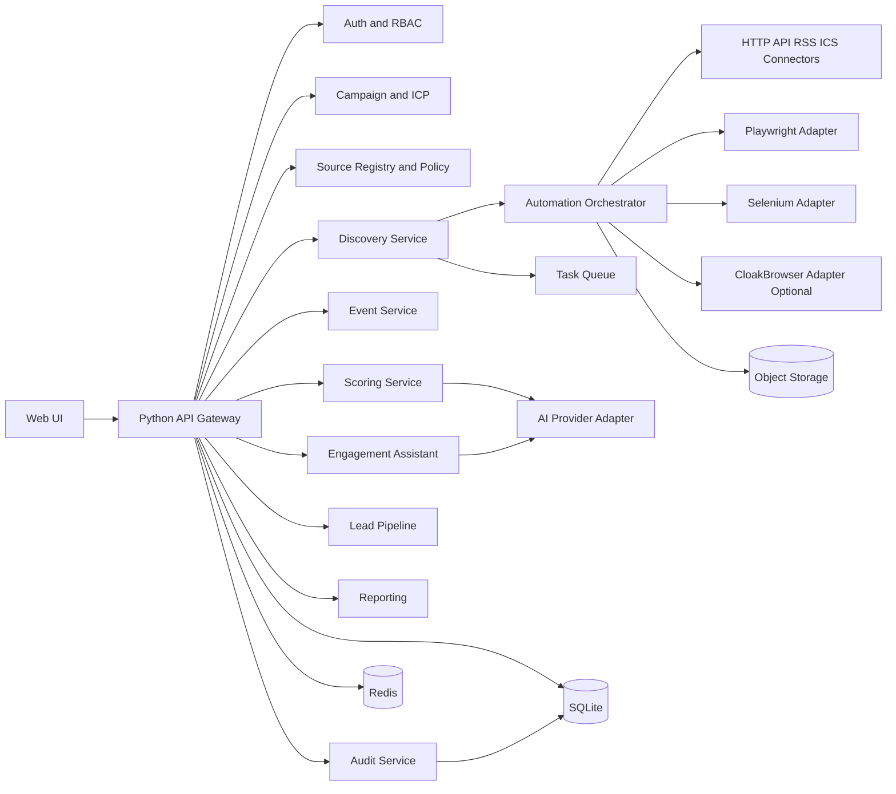

# Architecture

Source: `SPEC.md` sections 2, 3, 7, 8, 9, 10, 11, 17, and 18.

This document replaces the generic Harness template with the current
architecture direction for LiveLead. It is the implementation guardrail for
`US-001` and the first product stories that follow. It does not mean every
technology choice is final; open decisions remain explicitly named.

Related durable decisions:

- `docs/decisions/0008-livelead-mvp-baseline.md`
- `docs/decisions/0009-livelead-architecture-boundaries.md`
- `docs/decisions/0010-livelead-sqlite-primary-store.md`
- `docs/decisions/0011-livelead-technology-baseline.md`

## Current Repo State

US-001 added a foundation scaffold: `apps/api`, `apps/worker`, `src/livelead/`
layering, `frontend/` (Vite + React + shadcn-style UI), Alembic, project-local
SQLite under `data/livelead.sqlite3`, and Docker Compose Redis. See
`docs/FOUNDATION_RUNTIME.md`. Business domains and enforcement are still mostly
stubs; the architecture below remains the guardrail for follow-on stories.

## Architecture Direction

LiveLead should start as a modular monolith with process isolation only where it
materially reduces operational risk:

- `web-api`: Python API surface for REST and streaming endpoints.
- `worker`: asynchronous jobs for discovery, normalization, scoring, and AI.
- `scheduler`: scheduled discovery and follow-up work.
- `browser-worker`: isolated runtime for browser automation.
- `frontend`: interactive React + TypeScript web UI on Vite.
- `sqlite-db`: primary transactional store at a project-local path such as
  `data/livelead.sqlite3`.
- `redis`: Dramatiq broker, cache, rate limiting, and distributed coordination.
- `object-storage`: screenshots, HTML snapshots, traces, and exports.

This shape matches the MVP constraint that browser automation, AI generation,
tenant data, audit, and user-facing workflows all coexist, while still keeping
the system small enough to ship before splitting into microservices.

## Technology Baseline

The current implementation baseline is:

- Backend: Python 3.12+, FastAPI, Pydantic
- ORM and migrations: SQLAlchemy 2.x with Alembic
- Database: project-local SQLite
- Queue: Dramatiq + Redis
- Browser engines: Playwright by default, Selenium fallback, CloakBrowser only
  behind policy gates
- Frontend: React + TypeScript + Vite
- UI system: shadcn/ui
- AI boundary: OpenAI-compatible provider abstraction
- Testing: Pytest, Playwright E2E, Hypothesis
- Observability: OpenTelemetry, Sentry, Prometheus, Grafana
- Packaging: Docker Compose for development and single-host MVP

`docs/decisions/0011-livelead-technology-baseline.md` is the durable record for
these selections.

## Product Surfaces

- Browser-based web application for analysts, reviewers, admins, and sales/BD.
- Backend API for UI, background workers, and future integrations.
- Streaming channel for discovery progress and browser-session status.
- Background job execution for discovery, scoring, scheduling, reminders, and
  content generation.
- Headed browser session surface for supervised third-party interaction.

Mobile and desktop are not first-class app surfaces for MVP. Mobile support is
limited to simple viewing and updates through the web UI.

## Logical Topology



## Core Domains

The implementation should preserve stable boundaries for these product domains:

- Identity and tenancy: organization, user, session, role, tenant scope.
- Campaigns and ICP: campaign definition, ICP filters, scoring weights, search
  templates.
- Sources and policy: source registry, connector type, source policy, quota,
  credential references, approval metadata.
- Discovery: job lifecycle, scheduling, progress, cancellation, retry, query
  expansion.
- Events: canonical event records, provenance, normalization, deduplication,
  watchlist, exports.
- Audience and scoring: audience hypotheses, evidence links, event scoring,
  explainability, score versioning.
- Engagement: plan phases, task tracking, generated content, approval workflow,
  anti-spam policy.
- Browser operations: browser profiles, sessions, allowed actions, screenshots,
  confirmation checkpoints.
- Leads and reporting: leads, activities, reminders, funnel state, dashboards,
  exports.
- Audit and governance: audit records, retention, deletion, feature flags,
  connector health.

## Backend Layering

The backend should keep business rules away from frameworks and providers:

```text
domain
  <- application
      <- infrastructure
          <- interfaces
              <- apps
```

Meaning in LiveLead:

- `domain`: business concepts and rules for identity, campaigns, sources,
  discovery, events, scoring, engagement, leads, reporting, and audit.
- `application`: commands, queries, orchestrators, and policy-aware use cases.
- `infrastructure`: database, queue, storage, AI, browser, and connector
  implementations.
- `interfaces`: REST, streaming, auth/session parsing, and worker-facing DTO
  translation.
- `apps`: runtime entrypoints such as `api`, `worker`, `scheduler`, and
  `browser_worker`.

Recommended module shape for the Python codebase:

```text
apps/
  api/
  worker/
  scheduler/
  browser_worker/

src/livelead/
  domain/
    identity/
    campaigns/
    sources/
    discovery/
    events/
    scoring/
    engagement/
    browser_ops/
    leads/
    reporting/
    audit/

  application/
    commands/
    queries/
    services/

  infrastructure/
    db/
    queue/
    storage/
    ai/
    browser/
    connectors/
    observability/

  interfaces/
    rest/
    streaming/
    auth/
```

The exact folder names can change during scaffolding, but the boundaries should
not. In particular:

- `domain` must not depend on FastAPI, SQLAlchemy, SQLite driver details,
  Playwright, Redis, or AI SDKs.
- `application` owns use-case orchestration and audit-triggering side effects.
- `infrastructure` implements repositories, adapters, connectors, and external
  clients.
- `interfaces` parses HTTP, SSE/WebSocket, and authentication boundary data.
- `apps` wire process startup, dependency injection, routing registration, job
  runners, and runtime configuration without owning domain rules.

## Frontend Shape

The frontend is an app surface, not a static marketing shell. MVP should expose
these primary surfaces as navigable modules:

- Dashboard
- Campaign wizard and campaign detail
- Discovery results and event detail
- Content studio and approval workflow
- Lead pipeline
- Browser session console
- Source and connector administration

The frontend uses `Vite` as the baseline app framework and must preserve domain
separation in the UI state and use typed API contracts. `shadcn/ui` is the
single component-system baseline for MVP UI work.

## Data Ownership And Storage

SQLite is the source of truth for product records, stored as a project-local
database file such as `data/livelead.sqlite3`. It holds:

- tenant and user metadata
- campaigns and ICP settings
- source registry and policy metadata
- discovery jobs
- canonical events and provenance
- scoring records and explanations
- engagement plans and generated content metadata
- leads and activities
- browser profiles and session metadata
- audit records

Redis is operational state, not product truth. It may hold:

- queue messages
- rate-limit counters
- locks
- ephemeral job progress caches
- short-lived streaming coordination

Object storage holds large artifacts, including screenshots, HTML snapshots,
export files, and trace attachments. Product records should store references to
these artifacts, not inline blobs, unless the data is small and operationally
simpler in SQLite.

SQLite-specific guardrails for MVP:

- Prefer one application-managed writer path at a time for schema-changing or
  high-write workflows.
- Use migrations and startup checks that are compatible with SQLite.
- Keep the database file inside the project tree, but outside version control.
- Treat backup and restore as file-based operations coordinated with artifact
  storage and audit needs.

## Boundary Rules

### Parse-First Rule

Unknown input must be parsed at the boundary before entering domain or
application code. This includes:

- HTTP request bodies, params, and query strings
- session and identity claims
- environment variables
- provider payloads and webhook events
- connector extraction payloads
- browser recipe configuration
- database rows returned by infrastructure clients

### Command And Query Separation

- Commands mutate state and own audit side effects.
- Queries read state and shape responses for UI or integrations.
- Shared rules live in `domain` or `application`, not in controllers or React
  components.

### Tenant And Permission Enforcement

- Every command and query that reads or mutates product data must carry tenant
  scope explicitly.
- Backend enforcement is mandatory even if the UI hides actions.
- Audit must capture login attempts, approval decisions, sensitive browser
  actions, lead state changes, and policy violations.

## Automation And Connector Architecture

Automation must remain replaceable and policy-aware.

Browser and source integration should follow this flow:

```text
campaign criteria
  -> discovery command
  -> source policy check
  -> orchestrator
  -> connector selection
  -> HTTP/API/RSS/ICS first, browser only when needed
  -> normalized observations
  -> canonical event pipeline
```

Rules:

- Prefer official API, RSS, Atom, sitemap, or ICS sources before browser
  automation.
- Business logic must not import Playwright, Selenium, or CloakBrowser directly.
- Browser automation must sit behind a shared adapter contract.
- CAPTCHA, MFA, or bot challenge events must stop automation and switch to
  `NEEDS_USER_ACTION` or fail safely.
- External posting, submission, or destructive actions require explicit user
  confirmation.

Recommended adapter contract:

```python
from typing import Protocol


class BrowserAutomationAdapter(Protocol):
    async def start_session(self, profile_id: str | None = None) -> str: ...
    async def navigate(self, session_id: str, url: str) -> None: ...
    async def extract(self, session_id: str, recipe: dict) -> dict: ...
    async def screenshot(self, session_id: str) -> str: ...
    async def export_storage_state(self, session_id: str) -> dict: ...
    async def close_session(self, session_id: str) -> None: ...
```

## AI Integration Boundary

AI usage belongs behind a provider abstraction shared by scoring and engagement
features. The abstraction must preserve:

- prompt input grounding from approved product context
- output labeling as AI-generated
- approval workflow before external use
- logging of model/provider/version for auditability
- prompt injection defense at connector and content boundaries

The domain layer should never depend on a specific AI vendor SDK.

## Observability Contract

Application logs and product audit are different systems and must stay
separate.

The backend should emit one canonical structured log per request or job event
with:

- timestamp
- level
- request_id or job_id
- tenant_id when known
- user_id when known
- action
- duration_ms
- status_code when applicable
- message

Audit records are product facts. Logs are operational evidence.

## Validation Ladder

Implementation should prove architecture incrementally:

- Unit: pure domain rules, parsers, scoring math, policy evaluators, command
  validators.
- Integration: database repositories, queue behavior, source policy
  enforcement, adapter contracts, secret handling, tenant enforcement.
- Contract: connector normalization and provider boundary compatibility.
- E2E: campaign creation, discovery progress, event review, content approval,
  lead pipeline, browser-session confirmation flows.
- Platform: local environment startup, browser worker isolation, artifact
  storage wiring, deployment smoke checks.
- Security and audit: RBAC, tenant isolation, audit completeness, secret
  redaction, privacy and retention behavior.

## Open Decisions

These choices are intentionally still open and should be resolved in `US-001`
or the first affected story:

- exact authentication mechanism and SSO provider shape
- object storage provider for local and production environments
- whether `CloakBrowser` is approved at all for this product

Record durable decisions in `docs/decisions/` when any of these become fixed.
Until then, `0008`, `0009`, `0010`, and `0011` are the baseline architecture
records for the project.
